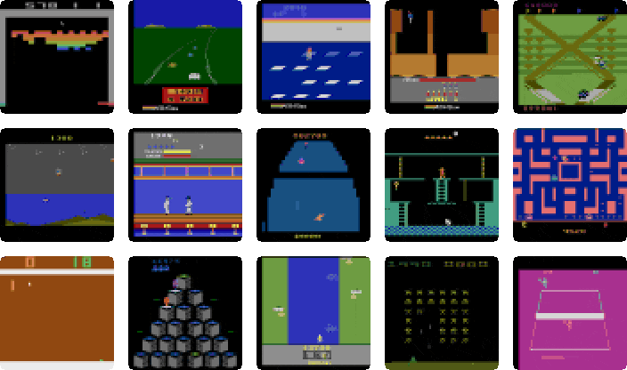
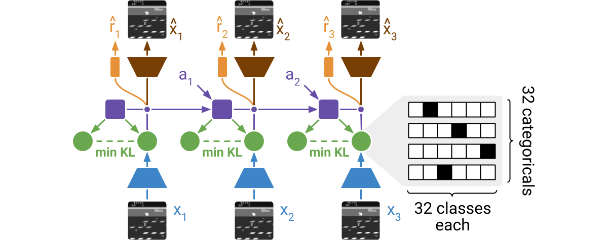
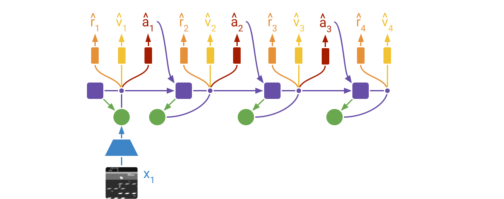

# DRL Project - DreamerV2
**Project for Deep Reinforcement Learning Course Summer Semester 2022 Cognitive Science at University Osnabrück**

<!-- ABOUT THE PROJECT -->
## About The Project
This project is part of the _'Deep Reinforcement Learning'_ course at the _University Osnabrück_.

We try to replicate the [DreamerV2 paper](https://arxiv.org/pdf/2010.02193.pdf) and evaluate its performance on the [Highway Environment](https://github.com/eleurent/highway-env), specifically on the "highway-fast-v0" environment.

In the following you can see an example GIF of the environment "highway-v0" without using any agent:


This is an example of the original [DreamerV2 repository](https://github.com/danijar/dreamerv2), which shows the **generated** images, using Atari Games as Environments. Its similiarity to the real game is truly astounding.



It uses an One Hot Categorical Vector as Embedding State.


DreamerV2 uses an A2C Agent to learn on the generated images or so-called "dreams" of the world model. Its interactions with the world model is layed out in the following image. Basically it uses the hidden state h (purple) of the world model and the previous action (red) to predict the next action (red), and also the next reward and done(terminal state boolean).



<p align="right">(<a href="#top">back to top</a>)</p>

<!-- Project Structure -->
## Project Structure
    .
    ├── images 
    ├── src                    
    │   ├──── checkpoints       # Here you can find all the checkpoints made during the training of the model.
    │   ├──── logs              # Here you can find generated images and Tensorboard Logs
    │   ├──── wandb             
    │   ├─ Agent.py
    │   ├─ main.py              # Main file of the project
    │   ├─ Parameters.py
    │   ├─ ReplayBuffer.py
    │   ├─ RSSM.py
    │   ├─ Trainer.py
    │   └─ WorldModel.py
    │
    │── .gitignore
    │── LICENSE
    │── main_colab.ipynb
    │── main_notebook.ipynb
    │── README.md
    │── requirements.txt
    └── workflow.yaml           # Configuration File for Paperspace

<p align="right">(<a href="#top">back to top</a>)</p>

<!-- GETTING STARTED -->
## Getting Started


### Prerequisites

The only thing you need to do, is to install all the requirements that are listed in requirements.txt. 
Feel free to use following command inside "DreamerV2" Project.

  ```
  pip install -r requirements.txt
  ```

In this Project "Weights & Biases"(short wandb) is utilized. You can disable it in Parameters.py under _use_wandb_. 

Otherwise, you need to create a [wandb account](https://wandb.ai/site) and get your API Key. I can fully recommend it! Besides that we have also included the option to use Tensorboard.


<p align="right">(<a href="#top">back to top</a>)</p>

### Colab Version

Alternatively you can use the provided Jupyter Notebooks main_colab.ipynb to instantly start using our project, without any hassle.

Feel also free to use this Online Colab Version: [Colab Link](https://colab.research.google.com/drive/186zBcHhCsQSmZ_rir8bGqb-2GWukIzMC?usp=sharing)


<p align="right">(<a href="#top">back to top</a>)</p>

<!-- USAGE EXAMPLES -->
### Usage
Run `main.py` while being in the `src` folder (as Working Directory).

You can change the most important settings and hyperparameters in the Parameters.py.

<p align="right">(<a href="#top">back to top</a>)</p>

<!-- AUTHORS -->
## Authors
* Fabio Klinge
* Lotta Piefke
* Peter Keffer

<p align="right">(<a href="#top">back to top</a>)</p>

<!-- ACKNOWLEDGMENTS -->
## Acknowledgments

Extensively used resources besides DreamerV2 Paper:

**Original Implemntation of DreamerV2**: \
https://github.com/RajGhugare19/dreamerv2/

**Highway Environment**: \
https://github.com/eleurent/highway-env

### Tools:

**Weights & Biases**: \
https://wandb.ai/site

<p align="right">(<a href="#top">back to top</a>)</p>
